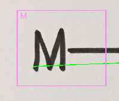
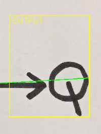
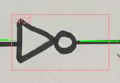
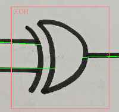
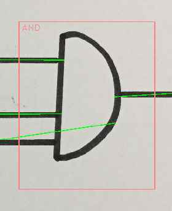
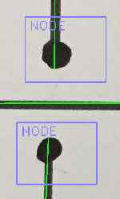
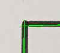
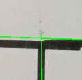

Implementation Notes
====================

The idea is to use the detected lines and labels to construct a [graph](https://en.wikipedia.org/wiki/Graph_theory)
corresponding to the diagram.

## Graph representation

The graph will be represented by a collection of `Vertex` objects.
The edges (connections between vertices) will be represented by a pair of object references,
in order to facilitate easy traversal of the graph in both directions.

Each `Vertex` object has:
* an associated bounding box
* optional name
* 0 or more inputs
* 0 or more outputs
* means to obtain a logical expression of itself and all its parent vertices

Connections always go between an output and an input.

There are several different types of vertices we will use. Some, we can create directly from the input labels.
Others are created while processing, to facilitate easy connections and junctions of the input lines.

### `InputTerm`

Has 0 inputs, and 1 output. Represents an input variable (e.g. J,K,M,...)

Generated logical expression is the term itself: `<name>`

### `OutputTerm`

Has 1 input and 0 outputs. Represents the result of the expression (e.g. Q)

Generated logical expression is in form `<name> = <input>`

### `Gate`

Represents a logic operation (gate). We support 2 types of gates:

#### `UnaryGate`

A gate with 1 input and 1 output (e.g. NOT).

Generated logical expression is in form `(<name> <input>)`

#### `BinaryGate`

 

**NB:** Misnomer, this is more like N-aryGate where N > 1

**TODO:** Implement support for more than 2 inputs.

A gate with 2-4 inputs and 1 output (e.g. AND, OR, XOR, ...)

Generated logical expression with 2 inputs is in form `(<input-1> <name> <input-2>)`

Generated logical expression with 3 inputs is in form `(<input-1> <name> <input-2> <name> <input-3>)`

Generated logical expression with 4 inputs is in form `(<input-1> <name> <input-2> <name> <input-3> <name> <input-4>)`

### `Node`

Has 1 input and 1 output. A pair of nodes represents a bridge (to avoid crossing lines).

Generated logical expression is: `<input>`

### `Connection`

Created during analysis.

Has 1 input and 1 output. Represents a corner in the connecting lines (horizontal and vertical lines connected at the end).

Generated logical expression is: `<input>`

### `Junction`

Created during analysis.

Has 1 input and 2 outputs. Represents a T-connection between a horizontal and vertical line.

Generated logical expression is: `<input>`

----

## Graph Creation

As first step, we can create collections of vertices from the input labels.
To simplify the analysis, we separate the vertices by type (inputs, outpus, gates, nodes).

We also separate the input lines into a two sets (vertical, horizontal) based on their slope.

The analysis consists of iterating over all the available `InputTerm`s, and processing them one at time.

### `InputTerm`

This vertex has a single output.
This means there must be a single horizontal line whose left endpoint is within the bounding box of this vertex.

Proceed by processing the connected horizontal line in the forward direction (input is left, output is right).

### Horizontal Line

Horizontal line may either go "forward" (input left, output right), or "backward" (input right, output left).
We consider the input as "startpoint" and output as "endpoint".

**TODO:** No more "backward" lines. This would facilitate loops and need more complicated checks to avoid them. Maybe later.

Mark the line as used (used lines are no longer considered for further analysis).

Horizontal line may have vertical lines connecting either in the central part (junctions, where the signal splits),
or at the endpoint (corners where horizontal connects to vertical). The vertical lines can go in "up" or "down" direction.
Process all connecting lines in sequence, creating `Junction` and `Connection` vertices as appropriate and connecting them.

If there is no endpoint corner, the line may connect to a gate input (the endpoint falls into the gate bounding box).
In that case, connect and process the respective gate.

If there is no gate connection, the line may connect to an output (the endpoint falls into the output bounding box).
In that case just add the connection and stop analysing this branch.

Having 0 connections is considered a fatal error.

### Vertical Line

Vertical line may either go "up" (input bottom, output top) or "down" (input top, output bottom).
We consider the input as "startpoint" and output as "endpoint".

Mark the line as used (used lines are no longer considered for further analysis).

There are two options for a vertical line. Either the endpoint may lie within the bounding box of a node.
In that case, process the node.

Otherwise, the line may connect (a corner) to a horizontal line (endpoint of vertical line is near startpoint of horizontal line).
In that case process the connecting horizontal line.

Having 0 connections is considered a fatal error.

### `Node`

A node may be processed in "up" or "down" direction.
An "up" node has an input vertical line connecting from the bottom, and expects to see another node above.
A "down" node has an input vertical line connecting from the top, and expects to see another node below.

Pick the closest node in the appropriate direction, withing a slope threshold, as the connecting node.
(Use center of node bounding box for the calculation)
Connect the two nodes.

Find a vertical line that has a starting point in the destination node bounding box. Process the vertical line.

### 'Gate'

Since gates may have multiple inputs and only one output, they may get processed more than once.
If there is already an output link, return without further processing.

Gate will have 1 horizontal line as an output, so find one with startpoint in gate bounding box.
Process the horizontal line.

----

